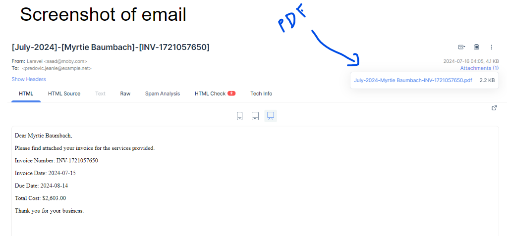
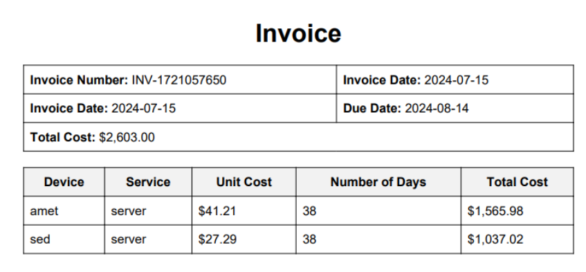
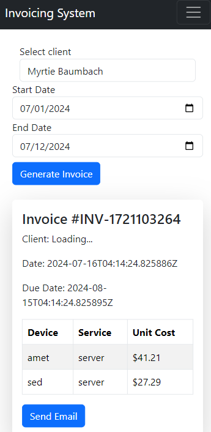

# Invoicing System
Frontend Github link: [Frontend GitHub](https://github.com/SmanSayeed/invoice-scheduler-frontend)
## Overview

This project is an integrated invoicing system for service providers, developed using Laravel for the backend and React.js for the frontend. The system is designed to be scalable and cloud-based, handling client and device management, invoice generation in multiple formats, email functionality, a reminder system for overdue invoices, and profiles for clients and service providers.

## Screenshots

<p align="center">
  
</P>
<p align="center">
  
</P>
<p align="center">
  
</p>

## Features

- **Client Management**: Add, edit, and manage clients.
- **Device Management**: Manage devices associated with clients.
- **Invoice Generation**: Generate invoices based on services provided, with detailed breakdowns.
- **Email Functionality**: Send invoices via email with attachments.
- **Reminder System**: Automatic reminders for overdue invoices.
- **Multi-format Invoices**: Generate invoices in PDF and other formats.

## Technologies Used

- **Backend**: Laravel
- **Frontend**: React.js, Bootstrap
- **Database**: MySQL
- **Authentication**: Laravel Sanctum
- **Role and Permission Management**: Spatie Laravel-Permission

## Installation

1. Clone the repository:

   ```bash
        git clone https://github.com/your-repository.git
   ```

2. Clone the repository:

   ```bash
        composer install
        cp .env.example .env  
        php artisan key:generate
        php artisan migrate --seed
        php artisan serve
        php artisan queue:worker
   ```
